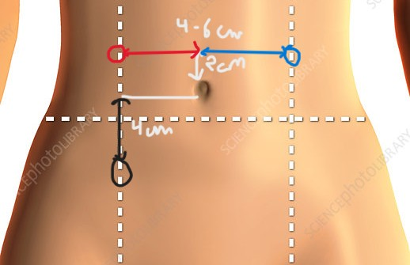

# Standard Operating Procedure
A guide on how to setup the MyoWare EMG sensor to collect cramping data.

---

## Hardware Setup

### Materials Required
- Arduino Uno
- Arduino-MyoWare shield
- MyoWare EMG sensor
- MyoWare cable shield
- MyoWare Link shield
- Electrodes
- USB-B cable
- 3.5mm audio connector
- Laptop

### Electrode Placement

> ⚠️ **MAKE SURE THE COMPUTER IS NOT CONNECTED TO A POWER OUTLET BEFORE COLLECTING DATA.**

Place electrodes on the abdominal region as follows:

| Electrode | Color | Position |
|-----------|-------|----------|
| V+ | Red | 4–6 cm lateral, 2 cm above umbilicus (left side) |
| V− | Blue | 4–6 cm lateral, 2 cm above umbilicus (right side) |
| Reference | Black | 4 cm below V+, between umbilicus and pubic symphysis |

### Procedure
1. Connect the Arduino Uno and the MyoWare Arduino shield.
2. Connect the sensor, Link shield, and cable shield.
3. Connect one end of the audio jack to the sensor and the other to the Arduino cable shield. Note which analog pin is used.
4. Connect the electrode cable to the Link shield.
5. Set up electrodes as shown in the table above.
6. Turn the sensor on.
7. Select the correct filter on the sensor — **RAW is recommended**.
8. Connect Arduino to computer.
9. Flash code.

---

## Software Setup

### Software Required
- Arduino IDE
- PuTTY

### Procedure
1. Update the code to reflect the correct analog pin used in hardware step 3.
2. Open PuTTY and select **Serial** connection type.
3. Match the COM port and baud rate in both the code and PuTTY.
4. Go to **Logging** and select **All session output**.
5. Set the log file name and save location using **Browse**. End the filename with `.csv`.
6. Open the connection only after both hardware and software are fully set up.

---

## Checklist

### Hardware
- [ ] Laptop disconnected from power outlet
- [ ] Arduino Uno and MyoWare Arduino shield connected
- [ ] Sensor, Link shield, and cable shield connected
- [ ] Audio jack connected (note analog pin)
- [ ] Electrode cable connected to Link shield
- [ ] Electrodes placed correctly
- [ ] Sensor turned on
- [ ] Filter set to RAW
- [ ] Arduino connected to computer
- [ ] Code flashed

### Software
- [ ] Analog pin updated in code
- [ ] PuTTY set to Serial connection
- [ ] COM port and baud rate matched
- [ ] Logging set to All session output
- [ ] Log file name ends in `.csv` and correct location set
- [ ] Connection opened
